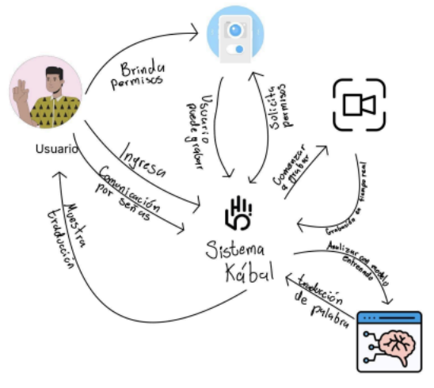

# Kabal — Traductor en Tiempo Real de Lengua de Señas Mexicana (LSM)

> **Proyecto de Ingenieria de Software II**
> 
> Universidad Autonoma Metropolitana
> — Ingenieria en Computacion
> 
> *Primera Iteracion*

---

## Descripcion General

**Kabal** es una aplicacion movil diseñada para traducir **Lengua de Señas Mexicana (LSM)** a texto y voz (tentativamente) en **tiempo real** mediante un modelo de inteligencia artificial previamente entrenado.

El sistema busca reducir barreras de comunicacion permitiendo que una persona realice señas frente a la camara del dispositivo y obtenga una traduccion inmediata en pantalla y, opcionalmente, en audio.

### Flujo de Funcionamiento

1. El usuario accede a la aplicacion y visualiza una **pantalla de inicio** con animacion de carga.
2. Se solicitan **permisos de camara**.
3. El usuario activa el **boton de grabar** para iniciar la captura de video en tiempo real.
4. Los fotogramas son enviados al **modelo de IA entrenado**, que analiza las señas y devuelve predicciones.
5. La traduccion se muestra en **texto en tiempo real** en pantalla.
6. Opcionalmente, el usuario puede activar la **salida en voz** para escuchar la traduccion.

---

## Diagrama de Contexto

El siguiente diagrama ilustra la interaccion entre el usuario, el sistema Kabal y los componentes externos involucrados en el proceso de traduccion.

<p align="center">
  
</p>

El diagrama muestra el flujo completo del sistema:

- El **usuario** ingresa a la aplicacion y brinda permisos de camara.
- Una vez habilitada la grabacion, el sistema captura video en **tiempo real**.
- Los fotogramas se envian al **modelo de IA entrenado**, que analiza el contenido y genera la traduccion de la palabra o frase detectada.
- El sistema devuelve la **traduccion al usuario** en pantalla (texto) y, opcionalmente, en audio (voz).

---

## Integrantes del Equipo

| Nombre |
|--------|
| Santiago Saucedo Mendoza |
| Pineda Escobar Kamila |
| Diego Hernandez Rodriguez |
| Amezcua Rios Erwin Rafael |
| Alvarez Barcenas Yamanic Balam |

---

## Caracteristicas Principales

- **Traduccion en vivo** — Reconocimiento de señas a traves de la camara en tiempo real.
- **Modelo de IA** — Red neuronal entrenada en Google Colab para clasificar palabras y frases en LSM.
- **Salida en texto** — Muestra la traduccion en texto en pantalla.
- **Salida en voz** — Convierte el texto traducido en audio (text-to-speech).
- **Flash integrado** — Boton para activar el flash en condiciones de baja iluminacion.
- **Configuracion** — Gestion de permisos (camara) desde la aplicacion.
- **Accesibilidad e Inclusion** — Diseñado para facilitar la comunicacion entre personas sordas y oyentes.

---

## Arquitectura del Sistema

### Interfaz Principal de Traduccion (RF-00)

```
+-------------------------------------+
|  [Config]                   [Flash] |
|                                     |
|  +------------------------------+   |
|  |                              |   |
|  |      Captura de Camara       |   |
|  |                              |   |
|  +------------------------------+   |
|                                     |
|  +------------------------------+   |
|  |  Texto traducido en tiempo   |   |
|  |  real aparece aqui...        |   |
|  +------------------------------+   |
|                                     |
|       [Grabar]     [Volumen]        |
+-------------------------------------+
```

---

## Requerimientos Funcionales

| ID | Nombre | Descripcion | Criticidad | Clasificacion | Complejidad |
|----|--------|-------------|------------|---------------|-------------|
| RF-00 | Interfaz principal de traduccion | Boton de configuracion, grabar y volumen | Alto | Salida | Alta |
| RF-00-00 | Pantalla de imagen | Muestra la captura de la camara | Alto | Salida | Media |
| RF-00-01 | Boton de configuraciones | Engranaje que lleva a interfaz de configuracion | Alto | Entrada | Baja |
| RF-00-02 | Boton de grabar/dejar de grabar | Inicia/detiene la traduccion en camara | Alto | Entrada | Media |
| RF-00-02-00 | Lenguaje de señas (entrada) | Video del usuario para ser traducido | Medio | Entrada | Baja |
| RF-00-02-01 | Salida en texto en tiempo real | Muestra en texto lo que se traduce | Alto | Salida | Media |
| RF-00-03 | Modelo entrenado | Modelo de IA para clasificar señas | Alto | Archivo interno logico | Alta |
| RF-00-04 | Boton activar/desactivar volumen | Activa o desactiva la emision de audio | Alto | Entrada | Baja |
| RF-00-04-00 | Salida en voz en tiempo real | Traduccion audible al activar volumen | Medio | Salida | Alta |
| RF-00-05 | Boton de flash | Activa flash para baja iluminacion | Medio | Entrada | Baja |
| RF-01 | Interfaz de configuracion | Boton deslizable permiso camara | Medio | Salida | Baja |
| RF-01-00 | Boton deslizable permiso camara | Activa/desactiva permiso de camara | Medio | Entrada | Baja |
| RF-02 | Interfaz de inicio | Mensaje de bienvenida y animacion de carga | Medio | Salida | Media |
| RF-02-00 | Animacion de carga | Mano saludando mientras carga el sistema | Bajo | Salida | Media |

---

## Requerimientos No Funcionales

| ID | Nombre | Descripcion | Criticidad | Clasificacion | Complejidad |
|----|--------|-------------|------------|---------------|-------------|
| RNF-00 | Calidad de video | Buena calidad para detectar a la persona | Alto | Latencia | Media |
| RNF-01 | Tiempo de respuesta | Traduccion en menos de 1 segundo por palabra | Alto | Latencia | Alta |
| RNF-02 | Tiempo de carga | Animacion no mayor a 2 segundos | Bajo | Latencia | Baja |
| RNF-03 | Proteccion de datos | No almacenar datos sin consentimiento | Alto | Seguridad | Baja |
| RNF-04 | Exactitud del modelo | Al menos 90% de exactitud | Alto | Calidad | Alta |
| RNF-05 | Compatibilidad | Funcional en la mayoria de dispositivos Android | Alto | Portabilidad | Alta |
| RNF-06 | Intuitividad | Iniciar traduccion en maximo 2 acciones | Alto | UI | Baja |
| RNF-07 | Retroalimentacion | Indicar claramente cuando esta grabando | Alto | UI | Baja |
| RNF-08 | Escalabilidad | Permitir seguir entrenando el modelo a futuro | Alto | Arquitectura | Alta |
| RNF-09 | Tamaño de la aplicacion | No exceder 150 MB de instalacion | Medio | Portabilidad | Alta |
| RNF-10 | Consumo de bateria | Sin consumo excesivo en sesiones de 10 min | Alto | Optimizacion | Alta |
| RNF-11 | Portabilidad del modelo | Exportacion de Google Colab a entorno movil | Alto | Mantenibilidad | Alta |

---

## Estimaciones del Proyecto

### Puntos de Funcion No Ajustados (PFNA)

| Tipo | Complejidad | Numero | Peso | Subtotal |
|------|-------------|--------|------|----------|
| Entrada | Baja | 5 | 3 | 15 |
| Entrada | Media | 1 | 4 | 4 |
| **Subtotal Entradas** | | | | **19** |
| Salida | Baja | 1 | 4 | 4 |
| Salida | Media | 4 | 5 | 20 |
| Salida | Alta | 2 | 7 | 14 |
| **Subtotal Salidas** | | | | **38** |
| Archivo interno logico | Alta | 1 | 15 | 15 |
| **Subtotal Archivos** | | | | **15** |
| | | | **PFNA Total** | **62** |

### Factor de Ajuste (FA)

| No. | Pregunta | Valor | Justificacion |
|-----|----------|-------|---------------|
| 1 | Copias de seguridad y recuperacion | 1 | Se requiere guardar los permisos aceptados por el usuario |
| 2 | Comunicacion de datos | 2 | Comunicacion solo en entrenamiento e interaccion del modelo |
| 3 | Procesamiento distribuido | 1 | Procesamiento local por ahora |
| 4 | Rendimiento critico | 5 | Vision por computadora y clasificacion neuronal en tiempo real con recursos limitados |
| 5 | Entorno operativo existente | 4 | Depende de controladores y gestion de camara del dispositivo |
| 6 | Entrada de datos interactiva | 5 | Se requiere constantemente de la camara |
| 7 | Transacciones sobre multiples pantallas | 2 | El flujo ocurre en una misma interfaz |
| 8 | Archivos maestros interactivos | 0 | No se gestionan archivos maestros dinamicos |
| 9 | Complejidad de entradas/salidas | 4 | Se procesa video en tiempo real con salidas en texto y voz |
| 10 | Procesamiento interno complejo | 5 | Procesamiento de imagenes, red neuronal y salidas en tiempo real |
| 11 | Codigo reutilizable | 3 | Se busca mejorar el modelo en futuras iteraciones |
| 12 | Conversion e instalacion | 3 | Conversion del modelo de Google Colab a formato movil |
| 13 | Multiples instalaciones | 4 | Ejecucion en multiples dispositivos con diferentes configuraciones |
| 14 | Facilidad de cambios y uso | 4 | Modularizacion de funciones para transparentar actualizaciones |
| | **Total** | **43** | |

- **FA = 0.65 + 0.01 x 43 = 1.08**

### Puntos de Funcion Ajustados

- **PF = PFNA x FA = 62 x 1.08 = 66.96**

### Duracion Estimada (Criterio de Jones)

| Escenario | Exponente | Duracion |
|-----------|-----------|----------|
| Mejor caso | 0.39 | 5.15 meses |
| Media | 0.42 | — |
| Peor caso | 0.45 | — |

Tipo de software: Software "Pret-a-porter"

### Estimacion COCOMO

Modo de desarrollo: **Organico**

| Modo | a | b | c | d |
|------|---|---|---|---|
| **Organico** | **2.4** | **1.05** | **2.5** | **0.38** |
| Semiacoplado | 3.0 | 1.12 | 2.5 | 0.35 |
| Empotrado | 3.6 | 1.20 | 2.5 | 0.32 |

**Datos iniciales:**

- PF = 66.96
- Factor de lenguaje = (50 + 42) / 2 = 46 (Java y Python)
- KLDC = PF x Factor de lenguaje / 1000 = 66.96 x 46 / 1000 = **3.08016**

**Calculo de esfuerzo:**

- Esfuerzo = a x (KLDC)^b
- Esfuerzo = 2.4 x (3.08016)^1.05 ≈ **7.8201 personas-mes**

**Calculo de duracion:**

- Duracion = c x (E)^d
- Duracion = 2.5 x (7.8201)^0.38
- **Duracion ≈ 5.4621 meses**

---

## Tecnologias (Tentativas)

| Componente | Tecnologia |
|------------|------------|
| Aplicacion Movil | Android (Java / Kotlin) |
| Modelo de IA | Google Colab, TensorFlow / TensorFlow Lite |
| Procesamiento de imagen | OpenCV / MediaPipe |
| Text-to-Speech | Android TTS API |
| Lenguajes | Java, Python |

---

## Alcance y Limitaciones

### Alcance

- Traduccion en tiempo real de un conjunto especifico de palabras y frases previamente entrenadas en LSM.
- Soporte de salida en texto y voz.

### Limitaciones

- Dependencia de condiciones adecuadas de iluminacion.
- Rendimiento sujeto a las capacidades del dispositivo movil.
- Alcance limitado al vocabulario del modelo entrenado.

---

*Desarrollado por el equipo Hi-5 — Universidad Autonoma Metropolitana, Ingenieria en Computacion.*